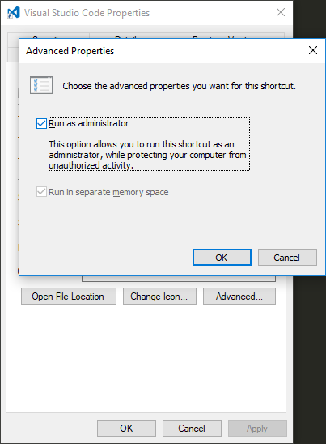

# vscode-dynamics-nav README

## The project is still not production ready.

## Links
* Install directly in vscode: `ext install dynamics-nav-scm`
* [VSCode Marketplace](https://marketplace.visualstudio.com/items?itemName=cloudreadysoftware.dynamics-nav-scm)

## Features

Easy create a local Microsoft Dynamics NAV environment.
Optimised for usage with git.

## Requirements

* [Visual Studio Code](https://code.visualstudio.com/docs/?dv=win)
* [Git](https://git-scm.com/download/win)
* Windows
* PowerShell 5.0
* [SQL Server](https://my.visualstudio.com/Downloads?q=sql%20server%202016%20developer) named `MSSQLSERVER`
* [Visual Studio Code]() running as [administrator](#run-as-admin)

## Folder Structure
```
root/
 ├── modified/          --modified Object files, splitted.
 │    └── *.txt
 ├── delta/             --delta Object files, splitted.
 │    └── *.txt
 ├── addin/             --Add-ins for your solution. DLL files.
 │    └── *.dll
 ├── reportlayouts/     --RDLC and Word layouts for your solution
 │    └── *.rdlc
 ├── addinresources/    --Add-in resources, zip-files for your add-in.
 │    └── *.zip
 └── original/          --Original objects files, splitted. Should be your base version. Modified files only.
      └── *.txt
```

## Run as admin


## Build from source

### Requirements
* [Node.js](https://nodejs.org)
* [gulp](gulpjs.com)
### Optional
* Publishing/signing: `npm install -g vsce`


## Authors

* Jens Rasmus Rasmussen - [Elbek & Vejrup](https://elbek-vejrup.dk/)
* [Jonas B. Andersen](https://github.com/joandrsn) - [Elbek & Vejrup](https://elbek-vejrup.dk/)
* Morten Braemer Jensen - [Elbek & Vejrup](https://elbek-vejrup.dk/)
* [Soren Klemmensen](https://github.com/MicrosoftDynamicsNAV) - [Cloud Ready Software](http://cloud-ready-software.com/)